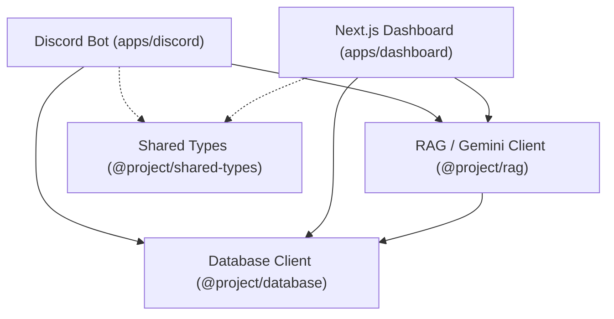

# Angbot Backend Developer Documentation

Welcome to the backend developer documentation for **Angbot**. This directory serves as a central reference manual for frontend dashboard engineers, Discord bot developers, and system administrators.

---

## 🏛 Architecture Overview

Angbot is structured as a **monorepo** powered by **Bun**. The repository is divided into applications (`apps/`) and shared library packages (`packages/`), allowing both the Next.js Dashboard and the Discord Bot to leverage the exact same schema, client configuration, and Retrieval-Augmented Generation (RAG) implementation.



---

## 📂 Codebase Navigation

The monorepo contains the following workspace modules:

*   **`apps/`**
    *   **[dashboard](../apps/dashboard)**: Next.js 16 Web Dashboard for user account management, agent creation, document uploads, and analytics. Powered by Auth.js for authentication.
    *   **[discord](../apps/discord)**: The Discord Bot client containing event listeners, command handlers, and system triggers.
*   **`packages/`**
    *   **[database](../packages/database)**: A shared wrapper package around **Prisma** which initializes and exports the database client.
    *   **[rag](../packages/rag)**: An environment-driven RAG library wrapping **Google Gemini**. Handles text extraction, token estimation, chunking, embedding, vector search, and LLM content generation.
    *   **[shared-types](../packages/shared-types)**: A shared package exporting common TypeScript types and interfaces used across workspaces.

---

## 📖 Available Documentation Pages

Please refer to the dedicated pages below for deeper API guides, code snippets, and integration walkthroughs:

1.  **[Database & Schema Guide](./database.md)**: Details the Prisma schema models (`User`, `Agent`, `Document`, `Chunk`, `DiscordBinding`, `AgentCall`) and instructions on using the shared `@project/database` client.
2.  **[RAG & Gemini Integration Guide](./rag.md)**: Explains the RAG ingestion, retrieval, context-building, and generation flows, along with env configurations.
3.  **[Authentication & Security Guide](./auth.md)**: Outlines Google OAuth, email/credentials signup, password hashing, and dashboard API security.
4.  **[Discord Bot Integration Manual](./discord-bot.md)**: A developer handbook specifically for building the Discord bot commands, linking channels/guilds, and tracking call telemetry.

---

## 🚀 Running Commands

### 1. In Development
Run the respective development servers from the root workspace:
```bash
# Run Next.js dashboard
bun run dev:dashboard

# Run Discord bot
bun run dev:bot
```

### 2. Database Commands
Apply migrations or open the database UI from the root workspace:
```bash
# Apply migrations to your local MariaDB/MySQL database
bun run db:migrate

# Open Prisma Studio to inspect tables visually
bun run db:studio
```

### 3. Formatting & Linting (Biome)
Make sure to check and format the codebase before committing changes:
```bash
# Lint, format, and apply auto-fixes across the entire monorepo
bun run check
```
